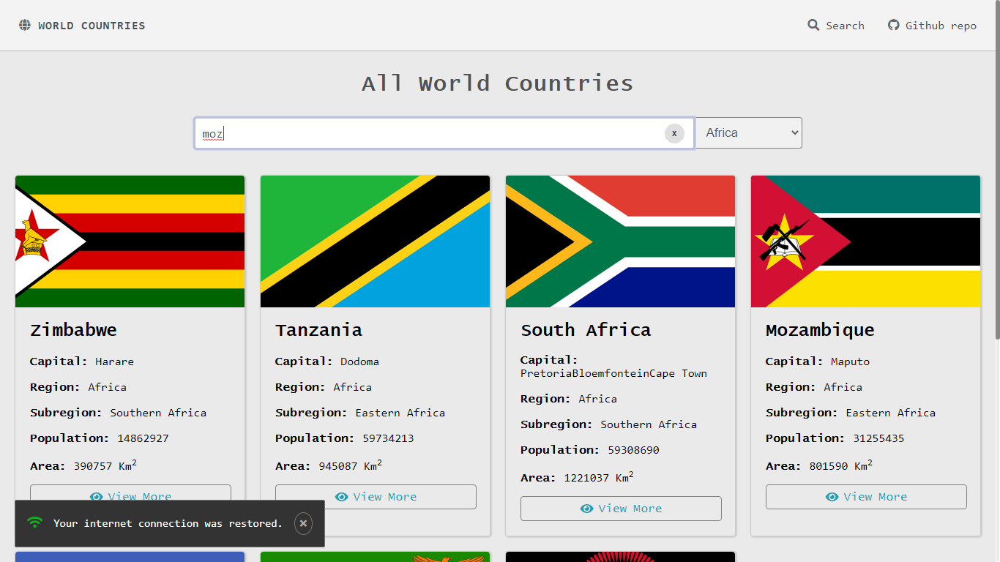
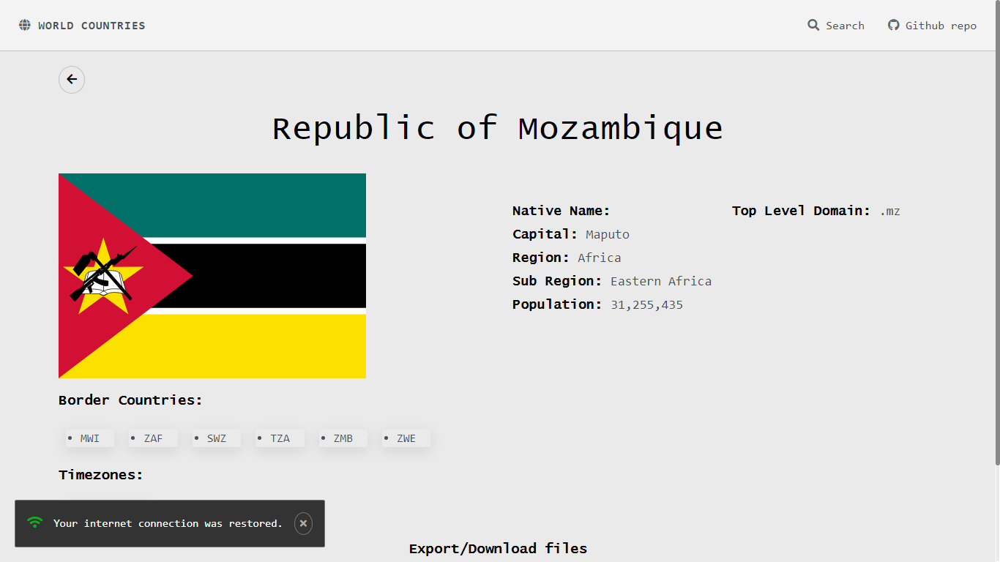

# Rest Countries Api React
This is a simple web page that provides some information about every country in the world. Those information comes from a Rest-Countries API.

-   [Live Demo 🌐](https://rest-countries-api-reactjs.herokuapp.com)

### DASHBOARD

### COUNTRY

